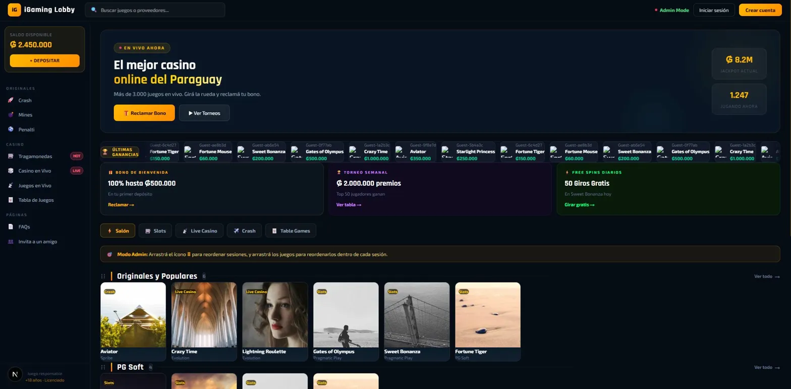

# iGaming Lobby

A fullstack web application for managing and displaying an iGaming casino lobby. The system allows administrators to manage a game library organized into sessions, with support for drag-and-drop reordering of both sessions and games within sessions.

---

## Table of Contents

- [Architecture Overview](#architecture-overview)
- [Requirements](#requirements)
- [Project Structure](#project-structure)
- [Getting Started](#getting-started)
  - [Running Locally](#running-locally)
  - [Running with Docker](#running-with-docker)
- [Database Seeding](#database-seeding)
- [Environment Variables](#environment-variables)
- [API Reference](#api-reference)
  - [Providers](#providers)
  - [Categories](#categories)
  - [Games](#games)
  - [Lobby Sessions](#lobby-sessions)
- [Authentication and Permissions](#authentication-and-permissions)
- [Technical Decisions](#technical-decisions)
- [Known Limitations](#known-limitations)

---

## Architecture Overview

The application is structured as a monorepo containing two independent services:

- **Backend**: REST API built with NestJS, TypeORM, and PostgreSQL.
- **Frontend**: Web interface built with Next.js and Tailwind CSS, featuring drag-and-drop functionality via dnd-kit.

Both services are containerized using Docker and orchestrated with Docker Compose.

---

## Requirements

### Local Development

| Dependency     | Minimum Version |
|----------------|-----------------|
| Node.js        | 20.x            |
| npm            | 10.x            |
| Docker         | 24.x            |
| Docker Compose | 2.x             |

### Recommended

- Linux or WSL2 on Windows
- Visual Studio Code

---

## Project Structure

```
igaming-lobby/
├── backend/
│   ├── src/
│   │   ├── app.module.ts
│   │   ├── main.ts
│   │   ├── seed.ts
│   │   ├── providers/
│   │   │   ├── provider.entity.ts
│   │   │   ├── providers.module.ts
│   │   │   ├── providers.service.ts
│   │   │   ├── providers.controller.ts
│   │   │   └── dto/
│   │   ├── categories/
│   │   │   ├── category.entity.ts
│   │   │   ├── categories.module.ts
│   │   │   ├── categories.service.ts
│   │   │   ├── categories.controller.ts
│   │   │   └── dto/
│   │   ├── games/
│   │   │   ├── game.entity.ts
│   │   │   ├── games.module.ts
│   │   │   ├── games.service.ts
│   │   │   ├── games.controller.ts
│   │   │   └── dto/
│   │   └── lobby-sessions/
│   │       ├── lobby-session.entity.ts
│   │       ├── lobby-sessions.module.ts
│   │       ├── lobby-sessions.service.ts
│   │       ├── lobby-sessions.controller.ts
│   │       └── dto/
│   ├── .env
│   ├── .npmrc
│   ├── package.json
│   └── tsconfig.json
├── frontend/
│   ├── app/
│   │   ├── layout.tsx
│   │   ├── page.tsx
│   │   └── globals.css
│   ├── components/
│   │   ├── GameCard.tsx
│   │   ├── SessionRow.tsx
│   │   ├── Sidebar.tsx
│   │   └── LastWins.tsx
│   ├── lib/
│   │   ├── api.ts
│   │   └── types.ts
│   └── package.json
└── docker-compose.yml
```

---

## Getting Started

### Running Locally

**Step 1. Clone the repository**

```bash
git clone https://github.com/Arik-S/igaming-lobby.git
cd igaming-lobby
```

**Step 2. Start the database**

```bash
docker compose up postgres -d
```

**Step 3. Install and run the backend**

```bash
cd backend
npm install --legacy-peer-deps
npm run start:dev
```

The API will be available at `http://localhost:3000`.

**Step 4. Seed the database with initial data**

In a new terminal:

```bash
cd backend
npm run seed
```

This will populate the database with providers, categories, games, and lobby sessions.

**Step 5. Install and run the frontend**

```bash
cd ../frontend
npm install
npm run dev
```

The web interface will be available at `http://localhost:3001`.

---

### Running with Docker

```bash
docker compose up --build
```

| Service    | URL                    |
|------------|------------------------|
| Frontend   | http://localhost:3001  |
| Backend    | http://localhost:3000  |
| PostgreSQL | localhost:5433         |

---

## Database Seeding

The seed script populates the database with the following initial data:

- 4 providers: PG Soft, Pragmatic Play, Evolution, Spribe
- 4 categories: Slots, Live Casino, Crash, Table Games
- 12 games distributed across providers and categories
- 4 lobby sessions with games assigned and ordered

To run the seed:

```bash
cd backend
npm run seed
```

> Note: The seed script will delete all existing data before inserting new records. Do not run it in a production environment.

---

## Environment Variables

### Backend (`backend/.env`)

| Variable      | Description                    | Default         |
|---------------|--------------------------------|-----------------|
| `DB_HOST`     | PostgreSQL host                | `localhost`     |
| `DB_PORT`     | PostgreSQL port                | `5433`          |
| `DB_USER`     | PostgreSQL user                | `igaming`       |
| `DB_PASSWORD` | PostgreSQL password            | `igaming123`    |
| `DB_NAME`     | PostgreSQL database name       | `igaming_lobby` |
| `PORT`        | Port the backend will listen on| `3000`          |

### Frontend (`frontend/.env.local`)

| Variable                | Description          | Default                 |
|-------------------------|----------------------|-------------------------|
| `NEXT_PUBLIC_API_URL`   | Backend API base URL | `http://localhost:3000` |

---

## API Reference

All write operations require the following HTTP header:

```
x-user-role: admin
```

If the header is absent or contains a value other than `admin`, the API will return `403 Forbidden`.

---

### Providers

#### GET /providers

Returns a list of all providers.

**Response 200**

```json
[
  {
    "id": 1,
    "name": "PG Soft",
    "description": "Proveedor de slots asiaticos"
  }
]
```

#### GET /providers/:id

Returns a single provider by ID.

**Response 200**

```json
{
  "id": 1,
  "name": "PG Soft",
  "description": "Proveedor de slots asiaticos"
}
```

**Response 404**

```json
{
  "statusCode": 404,
  "message": "Provider not found"
}
```

#### POST /providers

Creates a new provider. Requires `x-user-role: admin`.

**Request Body**

```json
{
  "name": "Evolution",
  "description": "Proveedor de casino en vivo"
}
```

**Response 201**

```json
{
  "id": 3,
  "name": "Evolution",
  "description": "Proveedor de casino en vivo"
}
```

**Response 403**

```json
{
  "statusCode": 403,
  "message": "Forbidden"
}
```

#### PUT /providers/:id

Updates an existing provider. Requires `x-user-role: admin`.

**Request Body** (all fields optional)

```json
{
  "name": "Evolution Gaming",
  "description": "Updated description"
}
```

**Response 200** - Returns the updated provider object.

#### DELETE /providers/:id

Deletes a provider by ID. Requires `x-user-role: admin`.

**Response 200** - Returns the deleted provider object.

---

### Categories

#### GET /categories

Returns a list of all categories.

**Response 200**

```json
[
  { "id": 1, "name": "Slots" },
  { "id": 2, "name": "Live Casino" }
]
```

#### GET /categories/:id

**Response 200**

```json
{ "id": 1, "name": "Slots" }
```

**Response 404**

```json
{ "statusCode": 404, "message": "Category not found" }
```

#### POST /categories

**Request Body**

```json
{ "name": "Crash" }
```

**Response 201**

```json
{ "id": 3, "name": "Crash" }
```

#### PUT /categories/:id

**Request Body**

```json
{ "name": "Table Games" }
```

**Response 200** - Returns the updated category object.

#### DELETE /categories/:id

**Response 200** - Returns the deleted category object.

---

### Games

#### GET /games

Returns all games including their provider and category relations.

**Response 200**

```json
[
  {
    "id": 1,
    "name": "Fortune Tiger",
    "thumbnail": "https://example.com/image.png",
    "provider": { "id": 1, "name": "PG Soft", "description": "..." },
    "category": { "id": 1, "name": "Slots" }
  }
]
```

#### GET /games/:id

**Response 200** - Returns a single game object with relations.

**Response 404**

```json
{ "statusCode": 404, "message": "Game not found" }
```

#### POST /games

**Request Body**

```json
{
  "name": "Fortune Tiger",
  "thumbnail": "https://example.com/image.png",
  "providerId": 1,
  "categoryId": 1
}
```

**Response 201** - Returns the created game object.

#### PUT /games/:id

**Request Body** (all fields optional)

```json
{
  "name": "Fortune Tiger Updated",
  "thumbnail": "https://example.com/new-image.png",
  "providerId": 2,
  "categoryId": 1
}
```

**Response 200** - Returns the updated game object.

#### DELETE /games/:id

**Response 200** - Returns the deleted game object.

---

### Lobby Sessions

#### GET /lobby-sessions

Returns all lobby sessions ordered by their `order` field, including all games with their relations.

**Response 200**

```json
[
  {
    "id": 1,
    "name": "Originales y Populares",
    "order": 0,
    "games": [
      {
        "id": 1,
        "name": "Fortune Tiger",
        "thumbnail": "https://example.com/image.png",
        "provider": { "id": 1, "name": "PG Soft" },
        "category": { "id": 1, "name": "Slots" }
      }
    ]
  }
]
```

#### GET /lobby-sessions/:id

**Response 200** - Returns a single session with games.

**Response 404**

```json
{ "statusCode": 404, "message": "Session not found" }
```

#### POST /lobby-sessions

**Request Body**

```json
{
  "name": "PG Soft",
  "order": 1,
  "gameIds": [1, 2, 3]
}
```

**Response 201** - Returns the created session with games.

#### PUT /lobby-sessions/:id

**Request Body** (all fields optional)

```json
{
  "name": "PG Soft Updated",
  "order": 2,
  "gameIds": [1, 2, 3, 4]
}
```

**Response 200** - Returns the updated session object.

#### DELETE /lobby-sessions/:id

**Response 200** - Returns the deleted session object.

#### PUT /lobby-sessions/reorder

Reorders all sessions. Accepts an ordered array of session IDs. The position of each ID in the array determines its new `order` value.

**Request Body**

```json
{ "ids": [3, 1, 4, 2] }
```

**Response 200** - Returns the full list of sessions in the new order.

#### PUT /lobby-sessions/:id/reorder-games

Reorders the games within a specific session.

**Request Body**

```json
{ "ids": [5, 2, 8, 1] }
```

**Response 200** - Returns the updated session with games in the new order.

#### POST /lobby-sessions/:id/games/:gameId

Adds an existing game to a session.

**Response 201** - Returns the updated session.

**Response 404** - If either the session or game does not exist.

#### DELETE /lobby-sessions/:id/games/:gameId

Removes a game from a session without deleting the game itself.

**Response 200** - Returns the updated session.

---

## Authentication and Permissions

The application does not implement a full authentication system. Access control is handled via a request header:

| Header         | Value   | Access Level              |
|----------------|---------|---------------------------|
| `x-user-role`  | `admin` | Full read and write access|
| `x-user-role`  | `user`  | Read-only access          |
| *(absent)*     |         | Read-only access          |

Operations that require admin access:

- POST, PUT, DELETE on `/providers`
- POST, PUT, DELETE on `/categories`
- POST, PUT, DELETE on `/games`
- POST, PUT, DELETE on `/lobby-sessions`
- PUT `/lobby-sessions/reorder`
- PUT `/lobby-sessions/:id/reorder-games`
- POST `/lobby-sessions/:id/games/:gameId`
- DELETE `/lobby-sessions/:id/games/:gameId`

---

## Technical Decisions

**Monorepo structure**
Both backend and frontend are maintained in a single repository to simplify development, version control, and delivery for this assessment.

**TypeORM with synchronize: true**
The `synchronize` option is enabled in development mode, which allows TypeORM to automatically update the database schema based on entity definitions. This avoids the need for manual migrations during development. This setting must be disabled in any production environment.

**Many-to-Many relationship between Game and LobbySession**
A game can appear in multiple sessions, and a session contains multiple games. This is modeled as a Many-to-Many relationship using a junction table `lobby_session_games`, which stores the association between sessions and games. Game order within a session is preserved by maintaining the insertion order in the junction table and reassigning the full game array on reorder operations.

**Order field on LobbySession**
Session ordering is managed via an explicit `order` integer column. When sessions are reordered, the API updates the `order` field for each session based on its position in the submitted ID array.

**Permission via request header**
As specified in the assessment requirements, permissions are implemented using the `x-user-role` header. This avoids the complexity of a full JWT authentication system while still demonstrating access control logic at the controller level.

**legacy-peer-deps**
Due to a peer dependency conflict between `@nestjs/mapped-types@2.1.0` and `class-validator@0.15.x`, all npm install commands require the `--legacy-peer-deps` flag. This is configured automatically via the `.npmrc` file in the backend directory.

---

## Known Limitations

- Game order within a session is stored implicitly via the Many-to-Many join table. A dedicated `order` column per game-session association would provide more robust ordering in high-concurrency scenarios.
- The seed script truncates all tables before inserting data. It is not idempotent and should not be run more than once per environment unless a full reset is intended.
- The `synchronize: true` setting in TypeORM is enabled for development convenience and must be replaced with proper migrations before any production deployment.
- Image thumbnails in the seed data use placeholder URLs. Real game artwork requires licensing agreements with the respective game providers.   

## Screenshots

### Lobby View
